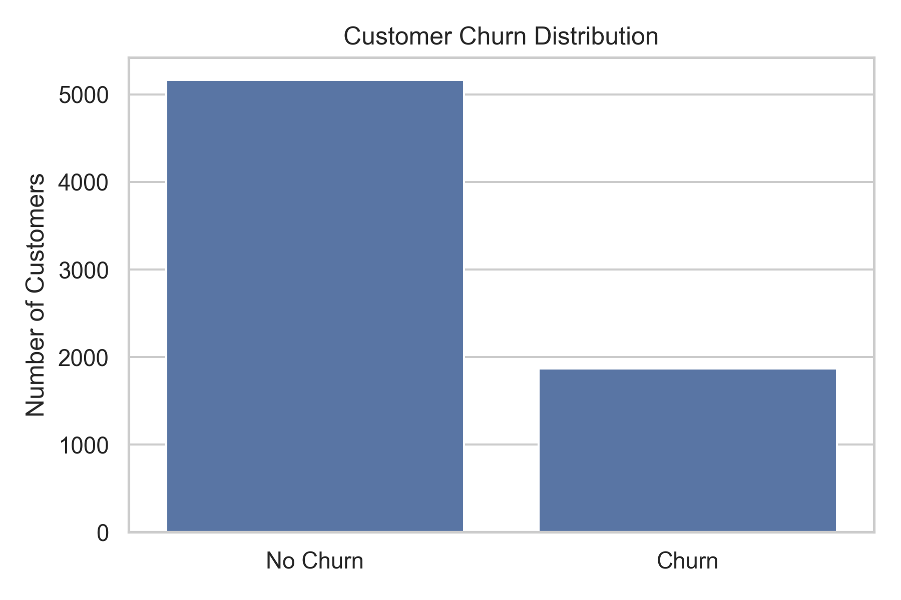
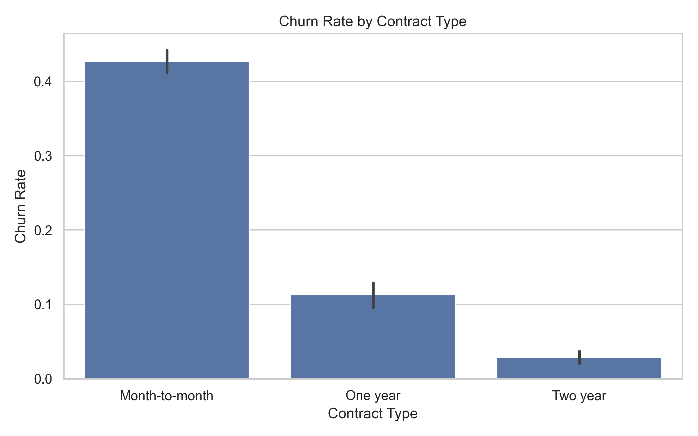
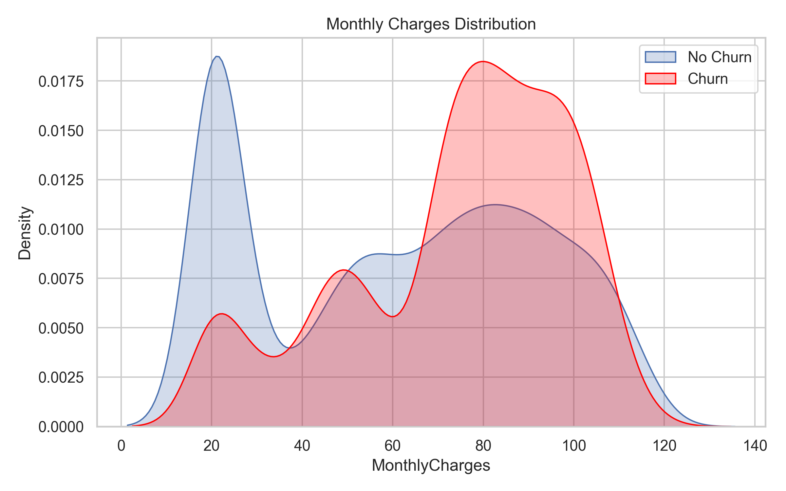

# Customer Churn Analysis

This project analyzes customer churn patterns using the Telco Customer Churn dataset.

The goal is to identify churn drivers and convert them into practical retention recommendations.

## Business Problem

A subscription-based business needs to reduce customer churn and prioritize retention actions.

The key questions:

1. What share of customers churn?
2. Which customer characteristics are linked to higher churn?
3. Which contract and payment patterns increase churn risk?
4. Which customer groups should retention teams prioritize?

## Dataset

Dataset: Telco Customer Churn.

Main fields used:

| Field | Description |
|---|---|
| customerID | Unique customer identifier |
| tenure | Number of months with the company |
| Contract | Contract type |
| MonthlyCharges | Monthly payment amount |
| TotalCharges | Total paid amount |
| InternetService | Internet service type |
| PaymentMethod | Payment method |
| Churn | Churn flag |

## Methodology

The analysis follows this workflow:

1. Load customer-level data.
2. Clean missing and incorrectly typed fields.
3. Calculate overall churn rate.
4. Compare churn by contract type, tenure, service usage, and monthly charges.
5. Visualize churn patterns.
6. Translate analytical findings into retention actions.

## Metrics

Churn rate:

```text
churn_rate = churned_customers / total_customers
```

Segment churn rate:

```text
segment_churn_rate = churned_customers_in_segment / total_customers_in_segment
```

Revenue exposure:

```text
monthly_revenue_exposure = churned_customers * average_monthly_charges
```

## Visualizations

### Churn Distribution



### Churn by Contract Type



### Monthly Charges and Churn



## Key Findings

1. Month-to-month contracts have higher churn than longer contracts.
2. Customers with higher monthly charges show stronger churn tendency.
3. Contract type is one of the clearest churn-related variables.
4. Tenure should be treated as a key retention dimension.

## Business Recommendations

1. Prioritize month-to-month customers for retention campaigns.
   They show the highest churn exposure.

2. Create offers for high-charge customers before churn risk increases.
   High monthly charges make churn more expensive for the business.

3. Encourage migration to longer contracts.
   Longer contracts are linked with stronger retention.

4. Build churn monitoring by tenure groups.
   Newer customers and short-tenure customers should be tracked separately.

5. Add churn prediction as the next project stage.
   EDA identifies patterns, but a scoring model would help prioritize individual customers.

## Limitations

- The current version is exploratory and does not include a predictive model.
- The analysis does not include acquisition source or marketing campaign history.
- Churn causes are inferred from patterns, not proven causally.
- Revenue impact is estimated only at a high level.
- Customer lifetime value is not calculated in the current version.

## Next Steps

Planned improvements:

- add logistic regression or tree-based churn model,
- calculate ROC-AUC, precision, recall, and confusion matrix,
- add feature importance,
- create churn risk tiers,
- estimate retention campaign ROI,
- add SQL version of the analysis.

## Tools

- Python
- Pandas
- NumPy
- Matplotlib
- Seaborn
- Jupyter Notebook
